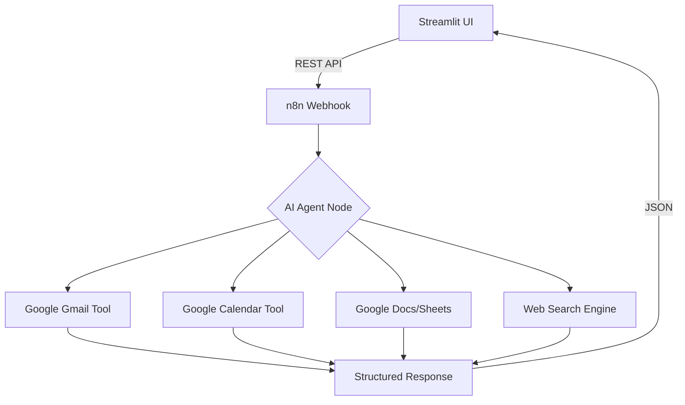

# 🤖 AI Personal Assistant (n8n + Streamlit)

<p align="center">
  
  
  
  
  
</p>

An enterprise-grade **AI-powered Personal Assistant** designed to bridge the gap between natural language and daily productivity tools. This system leverages **Agentic Workflows** to manage emails, calendars, notes, and finances autonomously.

---

## 🌟 Key Features

| Feature | Description | Integration |
| :--- | :--- | :--- |
| **🧠 Smart Reasoning** | Context-aware decision making using advanced LLMs. | Groq / Gemini / OpenAI |
| **📅 Calendar Management** | Automated meeting scheduling and conflict checking. | Google Calendar API |
| **📧 Email Automation** | Summarizes threads, drafts replies, and filters priority mail. | Gmail API |
| **✅ Task & Notes** | Convert chat history into actionable tasks or structured notes. | Google Tasks / Docs |
| **💰 Expense Tracking** | Log spending via natural language (e.g., "Spent 500 on lunch"). | Google Sheets |
| **🌐 Real-time Search** | Fetches live data from the web for up-to-date queries. | Brave / Tavily Search |

---

## 🏗️ System Architecture

The project follows a **Decoupled Frontend-Backend Architecture** to ensure scalability and ease of integration:



## 🛠️ Tech Stack

Frontend: Streamlit (Python-based interactive UI)

Orchestration: n8n (Low-code workflow automation)

Intelligence: Groq (Llama 3), Gemini Pro, or OpenAI GPT-4o

Backend Services: Google Cloud Platform (GCP) OAuth 2.0

Database/Storage: Google Sheets (for expenses) & Google Docs (for documentation)

---

## 🚀 Getting Started

### 1. Prerequisites

Python 3.9+

Node.js (for local n8n installation)

Google Cloud Console access (for API credentials)

---

### 2. Installation & Local Setup

```bash
# Clone the repository
git clone https://github.com/your-username/your-personal-assistant.git
cd your-personal-assistant

# Setup virtual environment
python -m venv venv
source venv/bin/activate  # On Windows: venv\Scripts\activate

# Install dependencies
pip install -r requirements.txt
```

---

### 3. n8n Configuration

Install n8n:

```bash
npm install n8n -g
```

Start n8n:

```bash
n8n start
```

Import the workflow from:

```
workflows/personal_assistant_workflow.json
```

Important: Configure your Google Credentials in n8n  
(Credentials → Add Credential → Google OAuth2).

---

### 4. Connect Streamlit to n8n

Update the webhook URL in your **app.py**:

```python
N8N_WEBHOOK_URL = "http://localhost:5678/webhook/your-unique-webhook-id"
```

---

## 💬 Usage Examples

Productivity:  
"What's on my schedule for tomorrow morning?"

Communication:  
"Draft a polite reply to the last email from John about the project update."

Finance:  
"I spent 1200 BDT on internet bills. Categorize it as Utilities."

Documentation:  
"Save a note: The brainstorming session focused on AI-driven UI improvements."

---

## 📈 Future Roadmap

- [ ] Voice Integration – Add OpenAI Whisper for speech-to-text input
- [ ] Multi‑modal Support – Analyze screenshots/receipts for expense tracking
- [ ] Messaging Bot – Access the assistant via WhatsApp or Telegram
- [ ] Local LLM Support – Integrate Ollama for fully private data processing

---

## 🤝 Contributing

Contributions are what make the open-source community such an amazing place to learn, inspire, and create.

1. Fork the Project
2. Create your Feature Branch (`git checkout -b feature/AmazingFeature`)
3. Commit your Changes (`git commit -m 'Add some AmazingFeature'`)
4. Push to the Branch (`git push origin feature/AmazingFeature`)
5. Open a Pull Request

---

## 📜 License & Credits

Distributed under the **MIT License**.

Created by **Anukul Chandra**.

If you find this project useful, consider giving it a ⭐ on GitHub!
